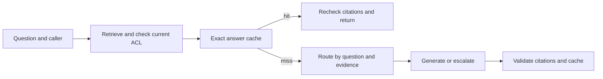

# Permission-scoped RAG cache and model routing

This standalone project extends a small retrieval-augmented generation (RAG) service with answer caching and an auditable model router. It runs offline with synthetic documents. The demo uses one deterministic extractive generator for both routes, so it tests plumbing and accounting rather than model quality.



## How it works

1. Retrieve candidate chunks and check each document against the current ACL store.
2. Look for a cached answer within the same tenant, user, evidence versions, ACL revisions, and pipeline revisions. Check access again before serving a hit.
3. On a miss, route a single-document fact question to the lower-priced model ID. Route multi-document or complex questions to the stronger model ID. An uncited answer from the cheaper route can escalate to the stronger route. If the final answer is still uncited, return an abstention while counting both model calls.
4. Validate citations, store only cited answers, and record latency, tokens, cache status, route reason, and estimated generation cost.

The in-memory cache has a capacity limit and time-to-live. Exact matching is the default. Semantic matching requires a threshold chosen from labeled paraphrases and near misses with `calibrate_semantic_threshold`; the demo does not enable it. Retrieval still runs before every cache lookup, so a hit saves generation work, not retrieval work.

## Run

Requires Python 3.11 or newer and [uv](https://docs.astral.sh/uv/).

```bash
uv run --extra dev pytest -q
uv run python scripts/evaluate.py
```

The evaluation script compares a baseline that always uses the strong model ID with the cache and router path on the same **100 ordered requests**. It generates 25 synthetic policy documents. For each policy, it asks a standard-value question once and repeats it twice. The fourth request is usually a distinct exception-value question. One fourth request instead compares two policy documents; that request retrieves two documents, while the others retrieve one. The workload contains 25 first asks, **50 exact repeats (50% of requests)**, 24 unique near misses, and one multi-document routing probe. Four near misses also exercise the complex-question route. The script derives these counts from the generated cases and prints cache hits, route counts, answer agreement, estimated generation cost, and local p50/p95 latency.

## Measured demo result

On this 100-request synthetic workload, the optimized path served **50 exact cache hits** and **zero near-miss cache hits**. All 24 near-miss questions produced a different source sentence from their paired standard-value question. The baseline and optimized paths agreed on all 100 answers. Routing decisions were 45 single-document fact calls, four complex-question calls, one multi-document call, and 50 cache hits. The multi-document case verifies routing only; the extractive demo generator does not synthesize an answer across documents.

Using the script's **illustrative prices and estimated token counts**, generation cost was `$0.01713` for the baseline and `$0.00251` for the optimized path in the current deterministic workload. Both model IDs run the same extractive generator, so this is an accounting demonstration, not measured model savings or quality. Local p50/p95 latency is printed on each run; the cache can be slower in this tiny in-memory demo because retrieval, authorization, and cache lookup still run. These numbers are not provider billing or CV-ready performance claims.

## What to measure next

Run held-out questions through two actual model endpoints. Record billed input and output tokens, current prices, correctness, citation faithfulness, p50 and p95 latency, cache hit rate, and every escalation attempt. Test permission changes while entries remain cached. Choose any semantic-cache threshold on a separate calibration set, then report false hits on held-out near misses.

The code uses an in-memory vector index and ACL store. A production service would need persistent stores, cache concurrency controls, invalidation across workers, and authenticated request identities.

Related projects: [permission-aware multi-tenant RAG](https://github.com/Sankew/secure-multitenant-rag) and [GraphRAG evidence retrieval](https://github.com/Sankew/graph-rag-evidence-retrieval).
